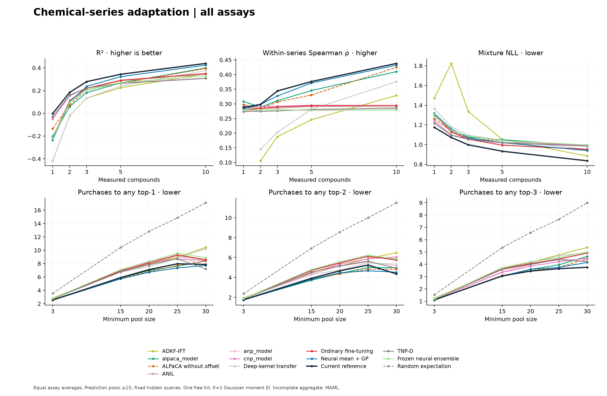
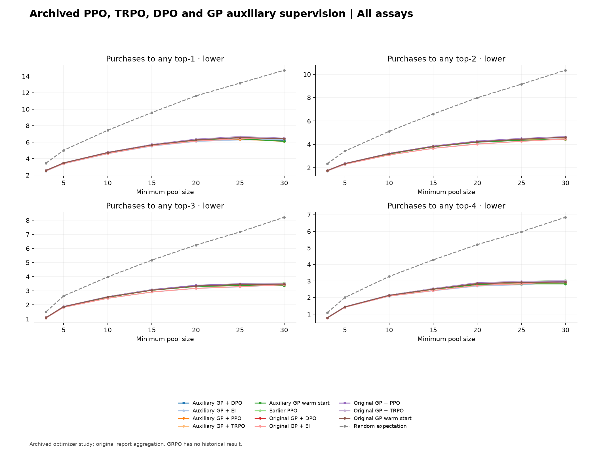
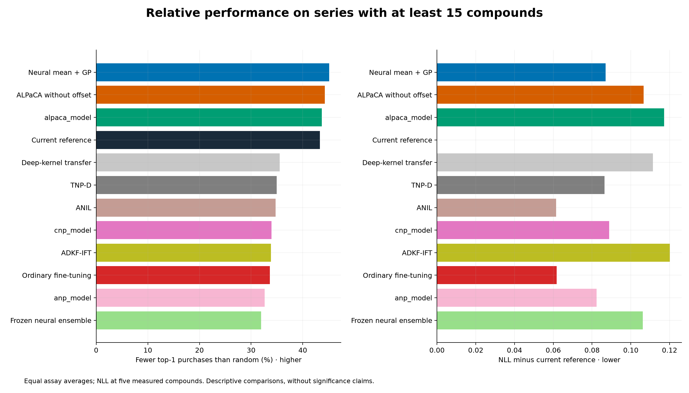

# Learning Hit-to-Lead Optimization

Predict properties within an unfamiliar chemical series, update those predictions as measurements arrive, and choose the next compound using expected improvement.

This repository packages the saved six-assay, five-fold comparison of the residual-kernel model against transfer-learning, few-shot, and meta-learning baselines, including the ALPaCA series-offset ablation. Scientific implementations were extracted from the completed experiments and checked against the original code.

The [full project summary](docs/analysis_summary.md) traces the earlier analyses, conclusions, corrections, and unresolved questions. A [searchable evidence catalog](results/analysis_history/index.html) covers 62 recorded branches with original reports, summary tables and source hashes. The [reproduction guide](docs/reproduction_guide.md) separates historical graph regeneration, inference with saved models, and fresh benchmark recipes.

Additional runnable analyses cover starting-hit percentiles, multi-hit contexts, removal of the best training compounds, fixed-query local-learning curves, counterfactual experiment value, and GP kernel comparisons including Morgan/Tanimoto. These recipes use the documented current protocol, have synthetic workflow tests, and write separate results.



## What is included

| Model identifier | Model | Local adaptation |
| --- | --- | --- |
| `reference` | Average pairwise mean with centered residual kernel and learned variance | 24 learned residual iterations, context summaries, conditional kernel variance |
| `transfer` | Frozen neural ensemble | Measured residual mean alignment |
| `finetune` | Ordinary fine-tuning | Support-contrast gradient updates to the selected transfer model |
| `neural_mean_gp` | Neural mean with conventional Gaussian process | Gaussian conditioning with a flat-prior series offset |
| `alpaca` | Adaptive learning for probabilistic connectionist architectures | Bayesian linear regression in a learned neural basis |
| `alpaca_no_offset` | ALPaCA offset ablation | Same basis and prior, with the additional series offset fixed to zero |
| `maml` | Model-agnostic meta-learning | Second-order meta-trained initialization, all-parameter adaptation |
| `anil` | Almost No Inner Loop | Meta-trained initialization, head-only adaptation |
| `cnp` | Conditional neural process | Permutation-invariant context pooling |
| `anp` | Attentive neural process | Context attention and a latent conditional distribution |
| `tnp_d` | Diagonal Transformer neural process | Masked context attention without positional encodings |
| `dkt` | Deep-kernel transfer | Learned representation with GP conditioning |
| `adkf_ift` | Adaptive deep-kernel fitting with implicit function differentiation | Locally optimized kernel parameters and learned shared representation |

The standard meta-learning benchmark uses **direct Gaussian moment expected improvement**, abbreviated EI, with one compound purchased at a time. Its random-selection control uses the exact expected purchase count. Earlier policy and batch comparisons are included below, with their original result tables and separate runnable recipes.

The assay endpoints are microsomal clearance, in vivo clearance, plasma protein binding, cellular clearance, permeability, and efflux. Clearances and efflux are minimized on a log scale. Permeability is maximized by minimizing its negative logarithm. Protein binding uses log bound/free ratio. See [the data contract](docs/data.md) before applying a model to a new assay.

## Earlier benchmarking comparisons

The [comparison guide](docs/past_comparisons.md) explains the implementations, original protocols and new runnable recipes.

| Comparison | Performance report |
| --- | --- |
| PPO, TRPO, DPO and GP auxiliary supervision | [Optimizer comparison](results/historical_figures/policy_optimization/comparison.pdf) |
| Mean/SD plus learned acquisition features | [Latent-feature comparison](results/historical_figures/latent_features/comparison.pdf) |
| Mean, kernel and reference-weighting changes | [Reference ablations](results/historical_figures/mean_kernel_ablation/comparison.pdf) |
| Deep Sets, pair-aware Transformer, Gumbel top-k and batch PPO | [Batch-selection comparison](results/historical_figures/batch_selection/comparison.pdf) |
| PPO with inputs used to calculate EI | [EI-input comparison](results/historical_figures/ei_input_ppo/comparison.pdf) |

The policy runner supports GRPO, PPO, and TRPO under a common protocol. Historical graphs show the completed archived experiments.



## Layout

```text
config/                  Editable absolute data/output paths and fixed run settings
src/hit_to_lead/
  models/                Separate model families and Gaussian posterior algebra
  distributions.py       Gaussian and Student-t mixtures
  data.py                Audited folds and context/query episodes
  data_import.py         Verified import of the exact prepared benchmark data
  training.py            Fresh fitting, checkpoint selection, exact resumption
  runner.py              Validation-only search and numerical-failure accounting
  inference.py           Prediction and next-compound API
  acquisition.py         Stable log expected improvement
  policy/                PPO, TRPO, GRPO, DPO and acquisition-feature experiments
  batch/                 Invariant subset scorers, delayed-feedback PPO and GP batch selection
  history.py             Reproducible plots from five earlier recorded comparisons
  analysis_catalog.py    Verified searchable index of 62 historical branches
  analyses/              Augmentation, local adaptation, and kernel comparisons
  evaluation.py          Fixed-query metrics and purchases to any top-1 through top-4
  reporting.py           Coverage-aware summaries and figures
scripts/                 Direct Python entrypoints, no command-line options
tests/                   Synthetic posterior, gradient, leakage, and recovery checks
results/published/       Original summary tables, coverage, and provenance
results/figures/         Reproducible PNG/PDF figures and combined report
results/historical/      Earlier study tables, original narratives and source hashes
results/historical_figures/  Earlier performance charts, separated by study
results/analysis_history/  Wider historical evidence and searchable catalog
results/analysis_history_figures/  Starting-hit and augmentation reports
docs/                    Methods, data contract, usage, source and migration records
```

## Run from any directory

Edit [config/paths.json](config/paths.json) to point to absolute locations. By default, new data copies, checkpoints, evaluations, and checks are written under `/Users/asselism/Documents/Codex/2026-09-23/i-h/outputs/repository_benchmark`. Published experiments remain read-only inputs. Model implementations have no imports from the historical experiment directories.

The following commands use the existing analysis environment on this machine. Each script resolves the repository from its own location, so no `cd` or editable installation is required.

Recreate the included figures from their CSV tables. This needs no model checkpoints or raw datasets.

```sh
/Users/asselism/Documents/Codex/2026-09-23/i-h/work/analysis_environment/bin/python /Users/asselism/Desktop/Collins_Lab/Repositories/learning_hit_to_lead_optimization/scripts/make_figures.py
```

Run the tests. These use small synthetic problems and do not launch the benchmark.

```sh
/Users/asselism/Documents/Codex/2026-09-23/i-h/work/analysis_environment/bin/python /Users/asselism/Desktop/Collins_Lab/Repositories/learning_hit_to_lead_optimization/scripts/run_tests.py
```

Import the exact prepared folds and then train/evaluate a fresh benchmark or resume a matching interrupted run. The full configuration is a substantial CPU experiment with four worker processes. ALPaCA without offset inherits the selected offset-model settings and is freshly initialized.

```sh
/Users/asselism/Documents/Codex/2026-09-23/i-h/work/analysis_environment/bin/python /Users/asselism/Desktop/Collins_Lab/Repositories/learning_hit_to_lead_optimization/scripts/prepare_data.py
/Users/asselism/Documents/Codex/2026-09-23/i-h/work/analysis_environment/bin/python /Users/asselism/Desktop/Collins_Lab/Repositories/learning_hit_to_lead_optimization/scripts/run_benchmark.py
```

The default scripts reproduce the benchmark recipe with fresh random initialization and validation selection.  To evaluate a smaller run, edit `config/benchmark.json` before starting and choose a new artifact root whenever the protocol or implementation changes.

See [usage examples](docs/usage.md) for prediction from existing checkpoints, environment setup, and report-only execution. This source-tree package is intended to run directly or through an editable installation, because configuration and published results remain visible beside the code.

## Reading the results

The [combined performance report](results/figures/performance_report.pdf) includes the all-assay overview, relative performance, and separate prediction/acquisition pages for each endpoint. [Numeric tables](results/published/main/overall_summary.csv) remain available for analysis.



The headline comparison uses series containing at least fifteen compounds. At five measured compounds, the equal-assay mean prediction scores are approximately

| Model | R² ↑ | Within-series Spearman ρ ↑ | Mixture NLL ↓ | Purchases to top-1 ↓ |
| --- | ---: | ---: | ---: | ---: |
| Current reference | 0.3436 | 0.3762 | 0.9325 | 5.9072 |
| Neural mean + conventional GP | 0.3225 | 0.3711 | 1.0195 | 5.7212 |
| ALPaCA | 0.2675 | 0.3454 | 1.0497 | 5.8690 |
| ALPaCA without offset | 0.2646 | 0.3304 | 1.0391 | 5.8092 |

Prediction metrics and acquisition counts use separate evaluation protocols. Acquisition begins with one free hit and continues until the target is reached. The offset ablation reports paired confidence intervals.

The main benchmark includes 353 of 360 fold evaluations and 69 of 72 complete endpoint/model comparisons. The all-assay aggregate requires complete five-fold coverage; MAML results are reported for microsomal clearance, permeability, and efflux. All thirty ALPaCA no-offset endpoint/fold evaluations completed.

Results are exploratory evaluations on development folds; intervals condition on the fitted models.

## Reproducibility and provenance

- [Methods and model definitions](docs/methods.md)
- [Data contract and transforms](docs/data.md)
- [Usage and inference examples](docs/usage.md)
- [Migration verification](docs/migration_verification.json)
- [Saved-checkpoint compatibility](docs/checkpoint_verification.json)
- [Historical numerical-code verification](docs/historical_code_verification.json)
- [Package verification](docs/package_verification.json)
- [Original scientific source hashes](docs/source_provenance.json)
- [Captured environment](results/published/documentation_environment.json)

No raw measurement tables, large fitted checkpoints, or cached molecule tensors are committed here. Their paths are configured explicitly. The repository retains exact prepared-data hashes and selected configurations. The [extended methodology handbook](/Users/asselism/Documents/Codex/2026-09-23/i-h/outputs/project_methodology/reproducible_methodology.pdf) documents the wider experimental history.
